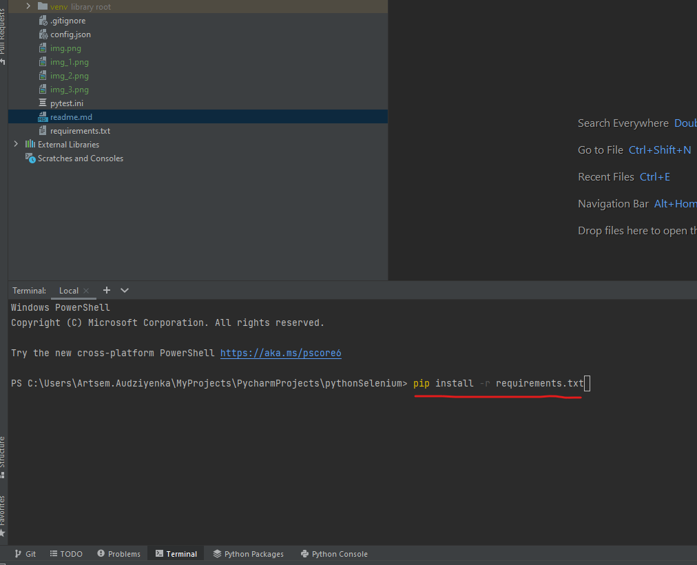

# Python + Selenium. Test Automation Framework
1. Selenium 4
2. PyTest
3. Allure
4. Web Driver Factory
5. Gmail Client
6. Wed Driver Listener
7. Page object, Factory patterns
8. User model
9. Wrappers to Web Element
10. Config.json with customize parameters (Headless mode, Browser Type, Timeout)

## Set-up environment
Install python 3.9 https://www.python.org/downloads/release/python-390/

Install some development environment, e.g. PyCharm https://www.jetbrains.com/pycharm/download

Clone this project via IDE.


Install all dependency from requirements.txt. Command line can be opened by pressing keys: **Alt + F12**

Type to command line
```
pip install -r requirements.txt
```

## Run test
Type to command line
```
py.test
```
## Generate allure report
```
py.test --alluredir report\allure
```
## Get allure report: 
```
allure serve report\allure
```

## Run only ui tests: 
```
pytest -v -m ui
```

## Run only api tests: 
```
pytest -v -m api
```